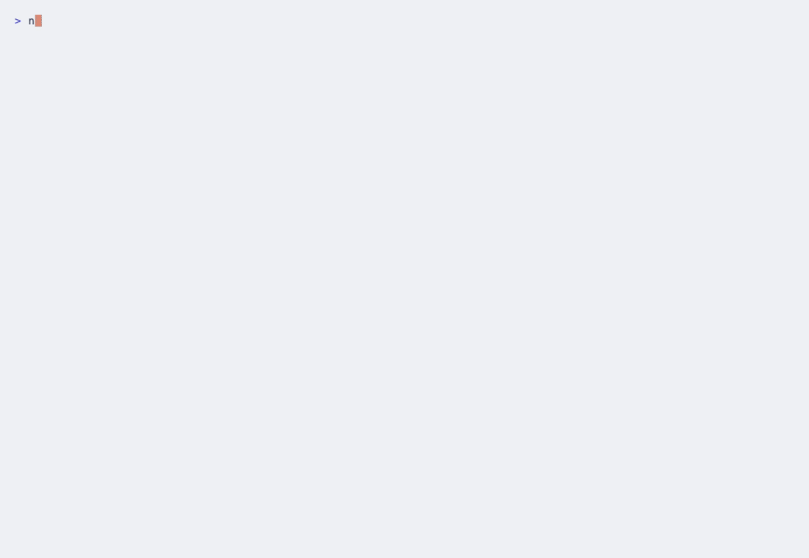
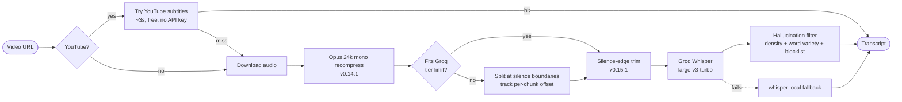

<div align="center">

# NEUROLEARN

**Learn from videos. Universal transcription + analysis for YouTube, Instagram, TikTok, and local files.**

[](LICENSE)
[](https://www.python.org/downloads/)
[](docs/CLAUDE_CODE.md)
[](https://github.com/nekith78/neurolearn/actions/workflows/test.yml)
[](https://github.com/nekith78/neurolearn/releases)

<picture>
  <source media="(prefers-color-scheme: dark)" srcset="assets/demo-dark.gif">
  
</picture>

</div>

---

## What it does

Pass a video URL or local file → get a clean transcript (`.txt` with optional
timestamps + `.srt`). Pick from 8 interchangeable backends — fully offline
Whisper, instant YouTube subtitles, or fast cloud APIs. Built to be driven
from the terminal **and** from a Claude Code chat.

## Highlights

- **8 backends, one interface** — `subtitles` · `whisper-local` · `gemini` · `groq` · `openai` · `deepgram` · `assemblyai` · `custom`. Switch with a single flag.
- **Smart cascade by default** — tries YouTube subtitles first, falls back to Groq Whisper, then local Whisper.
- **Any-length videos, transparently** — Opus 24k recompression + adaptive silence-aligned chunking handles 4-hour videos on Groq's free tier. Silence-edge trim + word-variety hallucination filter prevent Whisper from inventing text on silent intros/outros — validated across music / tech-talk / interview / news / tutorial formats with zero false positives.
- **Fast** — 1 hour of audio → 3.2 minutes wall time on Groq (~19× realtime). See [benchmarks](docs/BENCHMARKS.md).
- **Research + subscribes** — discover videos by topic across YouTube, IG, TikTok; subscribe to channels with incremental updates (YouTube pulls the `/videos` + `/shorts` tabs, so livestreams never masquerade as the latest upload).
- **Visual mode** — keyframes + per-moment vision-LLM annotations. Inside Claude Code, neurolearn writes a manifest and Claude reads the frames natively — no extra API call.
- **PDF reports** — `neurolearn report --latest` renders structured PDFs (tutorial / vlog / generic layouts) from any batch.
- **Offline-capable** — `--backend whisper-local` is fully offline. `--backend subtitles` only talks to YouTube.

## Why it exists

> [!TIP]
> **The killer use case: comprehensive research that combines Claude's web research with neurolearn-fetched video transcripts.** Claude reads web sources; neurolearn fetches what was only *said out loud* in podcasts, conference talks, interviews, and long-form YouTube. Together they cover both the documented and the candid layer of any topic.

A concrete prompt that triggers the pattern:

```
"Research the current state of agentic AI safety. Use both
 web sources and neurolearn to pull recent video interviews."
```

Claude reads web sources, runs `neurolearn research "agentic AI safety"
--days 90 --languages en --limit 20` in parallel, gets transcripts of 20
relevant talks and interviews, and writes a synthesis that catches what's
*only* said out loud alongside what's been written down.

Other patterns: daily channel digests, long-form video → structured PDF,
multi-language research without speaking the languages, offline / private
transcription. See **[docs/USE_CASES.md](docs/USE_CASES.md)** for full
walkthroughs.

## How smart cascade works

The default `--backend smart` flow — no flags needed:



End-to-end timestamps are preserved across chunking + silence-trim, so the final `.srt` matches the original video's timeline.

## Install

The two paths most people want:

### As a Claude Code plugin (recommended)

```
/plugin marketplace add nekith78/neurolearn
/plugin install neurolearn@neurolearn
```

```bash
uv sync && neurolearn config wizard
```

### As a standalone CLI

```bash
uv tool install git+https://github.com/nekith78/neurolearn
neurolearn config wizard
```

For other paths (manual clone, skill folder, pip), system requirements,
ffmpeg setup, and optional extras → see **[docs/INSTALL.md](docs/INSTALL.md)**.

> [!IMPORTANT]
> **Cookies are file-only.** YouTube/Instagram/TikTok cookies are registered via `neurolearn config set-cookies --from-file <path>` (or `subscribes cookies set <platform> --from-file <path>`). We deliberately do **not** support `--cookies-from-browser` — that yt-dlp flag pulls *every* cookie from your browser store into process memory. Heavy research without registered cookies WILL hit IP blocks. See [docs/UNLIMITED_RESEARCH.md](docs/UNLIMITED_RESEARCH.md).

## Quick start

```bash
# Transcribe a YouTube video — picks the best backend automatically
neurolearn transcribe https://youtu.be/dQw4w9WgXcQ
```

```bash
# Local file in Russian
neurolearn transcribe ~/Downloads/lecture.mp4 --language ru
```

```bash
# Whole channel, 10 most recent videos
neurolearn batch https://youtube.com/@anthropicai --limit 10
```

```bash
# Discover videos on a topic + auto-analyze with Gemini
neurolearn research "AI agents 2026" --days 14 \
  --prompt "Compare design choices" --analyze-backend gemini
```

```bash
# Inside Claude Code
/transcribe https://youtu.be/xyz
```

From any Claude Code chat:

> "Pull the latest 10 videos from @anthropicai via subtitles and write a topic summary"

Claude picks the right neurolearn subcommand, runs it, reads the output, and
writes the summary. The skill produces transcripts; analysis is the LLM's job.

## Documentation

| | |
|---|---|
| 💡 **[Use cases](docs/USE_CASES.md)** | The flagship Claude+neurolearn research pattern, plus 7 supporting workflows: channel digests, long-form → PDF, multi-language research, offline transcription, dataset building, claim verification, quote mining. |
| ⏱ **[Benchmarks](docs/BENCHMARKS.md)** | Wall-clock times for every feature on a 3:30 reference video, normalized to per-hour-of-audio rates. |
| 📖 **[Usage](docs/USAGE.md)** | Every command, every flag, with examples. `transcribe` · `batch` · `analyze` · `research` · `subscribes` · `report` · `history` · `triggers` · `config` |
| ⚙️ **[Backends](docs/BACKENDS.md)** | The 8 transcription backends compared. Hardware guide. Whisper model comparison. Groq size + hallucination handling. Privacy table. |
| 🤖 **[Claude Code integration](docs/CLAUDE_CODE.md)** | Plugin install, slash commands, switching backends from chat, secure key handoff, visual mode in Claude Code. |
| 💻 **[Install details](docs/INSTALL.md)** | Per-OS install, optional extras, first-run wizard, HF_TOKEN warning. |
| 🚀 **[Unlimited research](docs/UNLIMITED_RESEARCH.md)** | 3-layer anti-block stack: cookies → PO Token plugin → residential proxy. When YouTube rate-limits your IP. |
| 🩹 **[Troubleshooting](docs/TROUBLESHOOTING.md)** | yt-dlp 403, missing API keys, CUDA errors, missing ffmpeg, distil model on Mac, long-video timeouts. |
| 🏗️ **[Architecture](docs/ARCHITECTURE.md)** | For developers: Transcriber Protocol, smart cascade internals, adding a backend, cross-OS specifics. |
| 📜 **[Changelog](CHANGELOG.md)** | Version-by-version detail. |
| 🤖 **[Agent reference](docs/agent-reference.md)** | Full CLI surface, exit codes, state semantics — for LLM agents driving the skill. |
| 🍪 **[Cookies walkthrough](docs/cookies-walkthrough.md)** | Step-by-step screenshots for the yt-dlp 403 fix. |

## License

MIT — see [LICENSE](LICENSE).
